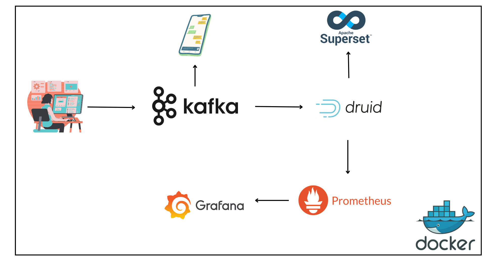

# Real Time Data Engineering Pipeline
- Pipeline development (End-to-end Data Engineering Pipeline)




### Setup for Mac OS user

```bash
nano ~/.zshrc
export DOCKER_DEFAULT_PLATFORM=linux/amd64
source ~/.zshrc
```
### Download Docker Desktop 
Sign up for an account in both Docker Hub (https://hub.docker.com) and Docker Desktop (https://www.docker.com/products/docker-desktop/)

Once sign up, login to Docker Desktop

Go to Settings (upper right) -> Resources -> Advanced -> Memory Limit: 7.5 GB.
(As many as your laptop can go, as Druid needs a minimum of 6GB RAM to run or else you will experience 137 error, or the historical and broker containers will shut down by itself)

IMPORTANT: Go to Network -> Set Enable host networking to be true.
(Port forwarding purposes. This is because Docker containers run in isolated to each other, meaning they are not directly linked from host machine. Port forwarding is used to link each of the container ports to your local host — in simpler terms, if you don’t enable this, you cannot access any localhost ports from the docker). 

Read this for further knowledge(https://docs.docker.com/engine/network/tutorials/standalone/) and this (https://docs.docker.com/engine/network/tutorials/host/) to further understand how docker networking works

### Setup Druid environment
1. Obtained from (https://github.com/apache/druid/blob/master/distribution/docker/environment)
2. Modify accordingly to your setup
3. If you want to emit more metrics, kindly refer to https://druid.apache.org/docs/latest/operations/metrics/ and add in the environment file. The metrics will be emitted via http to prometheus and we can query in Grafana for a neater visualization

Once all these is setup:

Run this if you got a powerful laptop:

```bash
docker-compose up -d
```

Please wait for a few minutes for all containers to run. If you are running on 8 GB RAM Laptop and below, please don’t attempt to run all these containers all at once. Begin running the Kakfa, Druid and Superset containers. Then, ran Druid, Grafana and Prometheus containers separately. Although we cannot really measure the query performances directly, we can upload data locally to Druid or we can run some test data queries to show on Grafana dashboard.

If you got a 8 GB laptop and below: run containers separately via Docker Desktop and or run this command to shut down a few containers like Superset, Grafana or Prometheus depending on your situation.

```bash
docker stop <container_name_or_id>
```

You may be prompted to login in terminal to pull docker image for druid-exporter (https://github.com/opstree/druid-exporter). You may face an error if you pull the image directly. Sign in with your docker hub (https://hub.docker.com) and login with your username and password. Your images will be downloaded after sign in. Please don’t confuse your Docker Desktop acc and Docker Hub acc. Here we use Docker Hub acc to login

```bash
docker login
username
password
```

Use command below to check all the running containers

```bash
docker-ps 
```

## How to Run Apache Kafka?

Apache Kafka has a few important components including ZooKeeper, Producer and Consumer. Zookeeper must be ran and be healthy in order for Kafka to operate smoothly. Producer produces the data which will be ingested to consumer. 

Below is the list of commands to ingest data into Kafka:

```bash
docker exec --workdir /opt/kafka/bin/ -it kafka_broker sh
./kafka-topics.sh --bootstrap-server kafka_broker:19092,kafka_broker_1:19092 --create --topic ecommerce9
./kafka-console-consumer.sh --bootstrap-server kafka_broker:19092,kafka_broker_1:19092 --topic ecommerce9 —from-beginning --partition 0
```

Then activate virtual environment and ran your Python Producer
In MacOS and VS Code:

```bash
source .venv/bin/activate
python Producer.py
```

IMPORTANT: Please ensure your Producer’s topic is tally to your Kafka commands. If it is ecommerce9, then ecommerce9

Your data will be ingested into consumer.

## Navigate to 

- localhost:8888 -> Druid
- localhost:9090 -> prometheus (You won’t see anything but important point is below)
- localhost:9090/targets -> If it is druid exporter is up, then it is good
- localhost:3000 -> Grafana
- localhost:8088 -> Superset


```bash


Login-in to Grafana
USERNAME=user
PASSWORD:SomePassword
```

Druid -> Ingest Data based on kafka_broker:19092 and the data will be ingested. If any processes failed, please run Druid Doctor and check if any of your Druid containers like Historical, Broker, Router etc are down. Usually it is related to your RAM. Your Docker may ran out of RAM to process and ingest data

Grafana: Dashboard is found in Manage Dashboard section on your left. Druid dashboard will appear.


How to add more monitoring metrics:

```bash
#Set data to default. Query your metrics according using this command for example:
druid_emitted_metrics{metric_name="query-cpu-time”, services="broker”}
```
